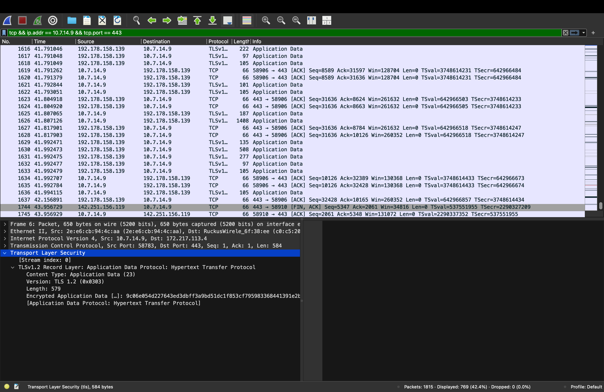
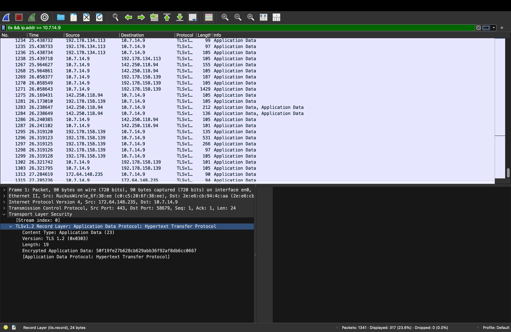
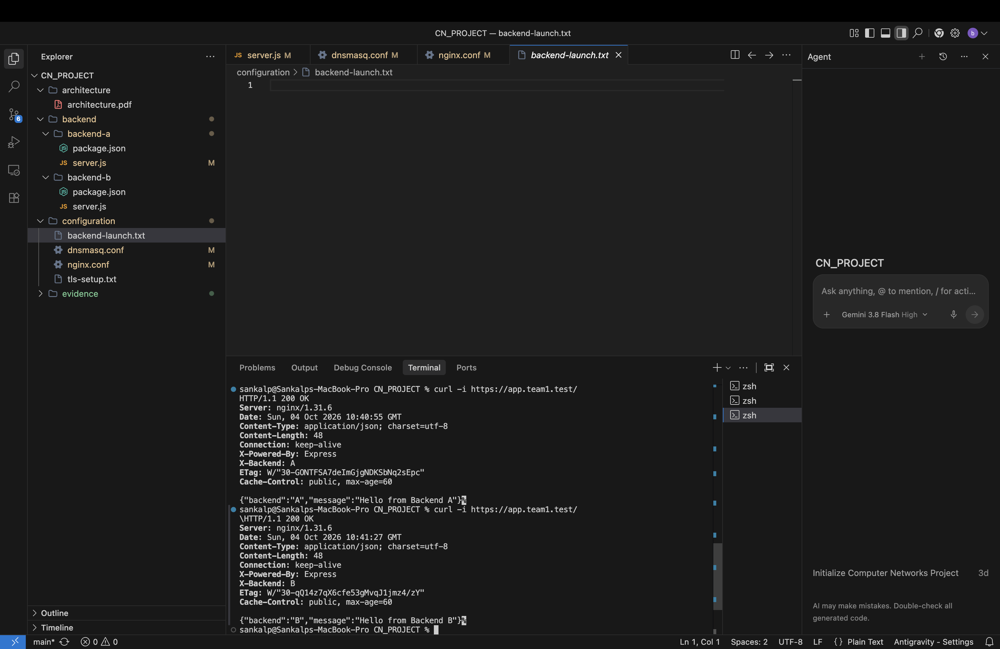

# Multi-Tier Private Network Service Platform
### Computer Networks Laboratory Project — Team 1 (Phase 1)

[](#)
[](#)
[](#)
[](#)

---

## 📌 Table of Contents
1. [Project Overview](#-project-overview)
2. [Team Members & Workstation Roles](#-team-members--workstation-roles)
3. [System Architecture & Network Topology](#-system-architecture--network-topology)
4. [Key Features & Implemented Networking Concepts](#-key-features--implemented-networking-concepts)
5. [Repository Structure](#-repository-structure)
6. [Step-by-Step Setup & Deployment Guide](#-step-by-step-setup--deployment-guide)
   - [Prerequisites](#prerequisites)
   - [Machine 1 (DNS Server) Setup](#machine-1-mac-1-dns-server-setup)
   - [Machine 2 (Edge Gateway & Backends) Setup](#machine-2-mac-2-edge-gateway--backends-setup)
7. [Verification & Testing Guide](#-verification--testing-guide)
8. [Empirical Verification Artifacts](#-empirical-verification-artifacts)
9. [Detailed Technical Specifications](#-detailed-technical-specifications)

---

## 📖 Project Overview

The **Multi-Tier Private Network Service Platform** is a distributed computer networking system designed and deployed across multiple physical workstations on an isolated local area network (LAN). 

The platform demonstrates how enterprise networking infrastructure works in practice by connecting:
- A **Dedicated Private DNS Resolver** (`dnsmasq`) for custom top-level domain service discovery (`*.team1.test`).
- An **Edge Reverse Proxy and Load Balancer** (`nginx`) providing TLS termination and traffic distribution.
- **Redundant Application Microservices** (Express.js) operating behind the edge proxy with health check APIs and identification headers.
- **Client-Side and Edge Caching** enforcing deterministic HTTP cache policies (`Cache-Control: public, max-age=60`).
- **Complete Transport Layer Security** enforcing HTTPS via strict HTTP 301 redirection.

---

## 👥 Team Members & Workstation Roles

| Member | Machine ID | Physical IP Address | Hardware MAC Address | Assigned Roles & Daemons |
| :--- | :--- | :--- | :--- | :--- |
| **Sankalp** | **Mac 1** | `10.7.0.221` | `10:9f:41:b6:11:88` | • Private DNS Server (`dnsmasq` on port `53`)<br>• Local domain authority for `*.team1.test`<br>• Upstream recursive forwarding to `8.8.8.8` |
| **Tejas Tyagi** | **Mac 2** | `10.7.14.9` | `10:9f:41:b3:be:81` | • Edge Reverse Proxy (`nginx` on ports `80` & `443`)<br>• TLS Terminator (TLSv1.2 / TLSv1.3)<br>• Round-Robin Load Balancer<br>• Backend A (`node` on port `3001`)<br>• Backend B (`node` on port `3002`) |

---

## 🌐 System Architecture & Network Topology

### High-Level Architecture Flow

```
+-----------------------------------------------------------------------------------------+
|                                    WI-FI LAN (10.7.0.0/20)                              |
+-----------------------------------------------------------------------------------------+
       |                                                                           |
       v (1. DNS Query: app.team1.test)                                            v (3. Encrypted HTTPS:443)
+-------------------------------+                         +-----------------------------------------------+
|             MAC 1             |                         |                     MAC 2                     |
|          10.7.0.221           |                         |                   10.7.14.9                   |
| ----------------------------- |                         | --------------------------------------------- |
|       dnsmasq (Port 53)       |                         |              Nginx Reverse Proxy              |
|   Resolves *.team1.test to    |                         |          Port 80 (HTTP 301 Redirect)          |
|      Mac 2 (10.7.14.9)        |                         |         Port 443 (TLS Termination & LB)       |
|                               |                         | --------------------------------------------- |
| Upstream: 8.8.8.8 (Google DNS)|                         |                Localhost IPC                  |
| Cache: 1000 entries           |                         |                127.0.0.1 Loopback             |
+-------------------------------+                         |             /                     \           |
       |                                                  |   Backend A (Express)     Backend B (Express) |
       +-- (2. Returns 10.7.14.9 to Client)               |     Port 3001 (TCP)         Port 3002 (TCP)   |
                                                          |     [X-Backend: A]          [X-Backend: B]    |
                                                          +-----------------------------------------------+
```

### Protocol Layer Stack
- **Layer 7 (Application)**: HTTP/1.1, DNS (RFC 1035), JSON payloads.
- **Layer 6 (Presentation)**: TLSv1.2, TLSv1.3 cryptographic termination at Nginx.
- **Layer 5 (Session)**: Keep-alive socket persistence (`keepalive_timeout 65`).
- **Layer 4 (Transport)**: UDP (Port 53 for DNS), TCP (Ports 80, 443, 3001, 3002).
- **Layer 3 (Network)**: IPv4 subnet `10.7.0.0/20`, external routing to `8.8.8.8`.
- **Layer 2 (Data Link)**: Ethernet II framing, hardware MAC addresses, ARP resolution.
- **Layer 1 (Physical)**: IEEE 802.11 Wi-Fi radio medium (`en0`).

---

## ✨ Key Features & Implemented Networking Concepts

### 1. Isolated Private Service Discovery
- Custom local domains `app.team1.test` and `api.team1.test` are authoritatively resolved by `dnsmasq` to Mac 2 without reliance on external public DNS or `/etc/hosts`.
- Configured with `cache-size=1000` to buffer query records.
- Recursive fallback to `8.8.8.8` ensures standard internet browsing remains fully functional.

### 2. Edge Reverse Proxy & TLS Termination
- Terminates all SSL/TLS encryption at Nginx on Mac 2, offloading cryptographic overhead from application services.
- Supports both **TLSv1.2** and **TLSv1.3** using custom X.509 certificates (`team1.crt` / `team1.key`).
- HTTP port `80` automatically redirects all requests to HTTPS via an HTTP `301 Moved Permanently` response.

### 3. Horizontal Round-Robin Load Balancing
- Distributes incoming HTTPS requests alternately across two local Express.js backend services:
  - **Backend A** listening on `127.0.0.1:3001`
  - **Backend B** listening on `127.0.0.1:3002`
- Guarantees even load distribution with zero session stickiness:
  $$\text{Target} = \text{backends}[\text{request\_counter} \pmod 2]$$

### 4. Client & Edge HTTP Caching
- Responses from the edge proxy include standard cache directives:
  ```http
  Cache-Control: public, max-age=60
  ```
- Backends provide entity tags (`ETag`) enabling HTTP `304 Not Modified` validation.

### 5. Transparent Client Context Forwarding
- Nginx injects header metadata before dispatching requests upstream:
  - `Host`: Original requested virtual host.
  - `X-Real-IP`: Client's physical IP address.
  - `X-Forwarded-For`: Chain of client/proxy IP addresses.
  - `X-Forwarded-Proto`: Ingress scheme (`https`).

---

## 📂 Repository Structure

```
CN_PROJECT/
├── README.md                      # Project overview, setup, and execution manual
├── package.json                   # Project dependencies (Express.js)
├── package-lock.json              # Dependency lockfile
├── backend-a.js                   # Node.js backend instance A (Port 3001)
├── backend-b.js                   # Node.js backend instance B (Port 3002)
│
├── architecture/                  # Architectural and topological documentation
│   ├── architecture.md            # Comprehensive system & protocol specification
│   ├── topology.md                # Network topology, socket matrix, and traffic flows
│   └── atricture.md               # Symbolic link to architecture.md
│
├── configuration/                 # System and daemon configuration files
│   ├── dnsmasq.conf               # Private DNS resolver configuration for Mac 1
│   ├── nginx.conf                 # Edge reverse proxy, TLS, & upstream load balancer config
│   ├── backend-launch.txt         # Launch commands reference for backend daemons
│   └── tls-setup.txt              # OpenSSL certificate generation reference
│
└── evidence/                      # Wireshark packet captures and terminal verification
    ├── dns/
    │   └── DNS EVI.png            # Wireshark trace of DNS query/response over UDP 53
    ├── tcp/
    │   └── TCP.png                # Wireshark trace of TCP 3-way handshake on port 443
    ├── tls/
    │   └── TLS.png                # Wireshark trace of TLSv1.2 Application Data records
    ├── http/
    │   └── HTTP EVI.png           # Wireshark trace of direct HTTP request/response
    ├── load-balancing/
    │   └── Load Balancing.png     # Terminal proof of alternating round-robin backends
    └── caching/
        └── Caching.png            # Header validation showing Cache-Control directives
```

---

## 🚀 Step-by-Step Setup & Deployment Guide

### Prerequisites
- **macOS** with Homebrew installed.
- **Node.js** (v18+ or v20+).
- **Nginx** (`brew install nginx`).
- **dnsmasq** (`brew install dnsmasq`).
- **Wireshark** (for packet capture and protocol verification).

---

### Machine 1 (Mac 1: DNS Server) Setup

1. Install `dnsmasq`:
   ```bash
   brew install dnsmasq
   ```
2. Start `dnsmasq` using the project configuration file:
   ```bash
   sudo dnsmasq -C /path/to/CN_PROJECT/configuration/dnsmasq.conf -d
   ```
   *Note: Runs in foreground with `log-queries` active for real-time inspection.*

---

### Machine 2 (Mac 2: Edge Gateway & Backends) Setup

#### 1. Install Node Dependencies
```bash
cd /Users/tejastyagi/Desktop/CN_PROJECT
npm install
```

#### 2. Launch Backend Microservices
Open two background or persistent terminal sessions:

- **Launch Backend A (Port 3001)**:
  ```bash
  node backend-a.js
  ```
- **Launch Backend B (Port 3002)**:
  ```bash
  node backend-b.js
  ```

#### 3. Setup TLS Certificates
Ensure the TLS certificate and private key are in place:
```bash
sudo mkdir -p /opt/homebrew/etc/nginx/certs
sudo cp /Users/tejastyagi/Desktop/team1.crt /opt/homebrew/etc/nginx/certs/team1.crt
# Or generate a new self-signed certificate if needed:
sudo openssl req -x509 -nodes -days 365 -newkey rsa:2048 \
  -keyout /opt/homebrew/etc/nginx/certs/team1.key \
  -out /opt/homebrew/etc/nginx/certs/team1.crt \
  -subj "/CN=*.team1.test"
```

#### 4. Launch Nginx Edge Proxy
```bash
# Test configuration syntax
sudo nginx -t -c /Users/tejastyagi/Desktop/CN_PROJECT/configuration/nginx.conf

# Start or reload Nginx
sudo nginx -c /Users/tejastyagi/Desktop/CN_PROJECT/configuration/nginx.conf
# If already running:
sudo nginx -s reload
```

---

## 🧪 Verification & Testing Guide

Run the following test commands from any machine on the network configured to use Mac 1 (`10.7.0.221`) as its DNS resolver:

### 1. Test Private DNS Resolution
```bash
dig @10.7.0.221 app.team1.test +short
# Expected output: 10.7.14.9

dig @10.7.0.221 api.team1.test +short
# Expected output: 10.7.14.9
```

### 2. Test Insecure HTTP Redirection (Port 80 -> 443)
```bash
curl -I http://app.team1.test
```
**Expected Output:**
```http
HTTP/1.1 301 Moved Permanently
Server: nginx/1.31.6
Location: https://app.team1.test/
```

### 3. Test Secure HTTPS & TLS Termination (Port 443)
```bash
curl -k -i https://app.team1.test/
```
**Expected Output:**
```http
HTTP/1.1 200 OK
Server: nginx/1.31.6
Content-Type: application/json; charset=utf-8
X-Backend: A
Cache-Control: public, max-age=60

{"backend":"A","message":"Hello from Backend A"}
```

### 4. Test Round-Robin Load Balancing
Send multiple sequential requests to verify round-robin alternation between Backend A and Backend B:
```bash
for i in {1..6}; do curl -s -k -D - https://app.team1.test/ -o /dev/null | grep "X-Backend"; done
```
**Observed Output:**
```text
X-Backend: A
X-Backend: B
X-Backend: A
X-Backend: B
X-Backend: A
X-Backend: B
```

### 5. Test Backend Health Check Endpoints
```bash
curl -k -s https://app.team1.test/api/status
# Returns: {"backend":"A","status":"running"} or {"backend":"B","status":"running"}
```

---

## 📸 Empirical Verification Artifacts

All verification artifacts are stored in the [`evidence/`](evidence/) directory:

| Protocol / Layer | Verified Behavior | Evidence Image |
| :--- | :--- | :--- |
| **DNS (UDP:53)** | `app.team1.test` resolved to `10.7.14.9` via Mac 1 (`10.7.0.221`) | [](evidence/dns/DNS%20EVI.png) |
| **TCP (TCP:443)** | Full TCP 3-way handshake and connection teardown on port 443 | [](evidence/tcp/TCP.png) |
| **TLS (Security)** | Application Data encryption via TLSv1.2 (Content Type 23) | [](evidence/tls/TLS.png) |
| **HTTP (Direct)** | Raw HTTP request and JSON response from Backend A on port 3001 | [](evidence/http/HTTP%20EVI.png) |
| **Load Balancing**| Strict alternation between Backend A and Backend B across requests | [](evidence/load-balancing/Load%20Balancing.png) |
| **HTTP Caching** | Response headers confirming `Cache-Control: public, max-age=60` and `ETag` | [](evidence/caching/Caching.png) |

---

## 📚 Detailed Technical Specifications

For comprehensive, in-depth architectural and topological documentation, refer to:
- 📄 **[System Architecture Specification](architecture/architecture.md)**: Deep dive into the multi-tier design, layer mapping, cryptographic lifecycle, and fault tolerance.
- 🗺️ **[Network Topology Specification](architecture/topology.md)**: Physical and logical diagrams, socket and port allocation matrices, subnet calculations, and packet flow trajectories.
