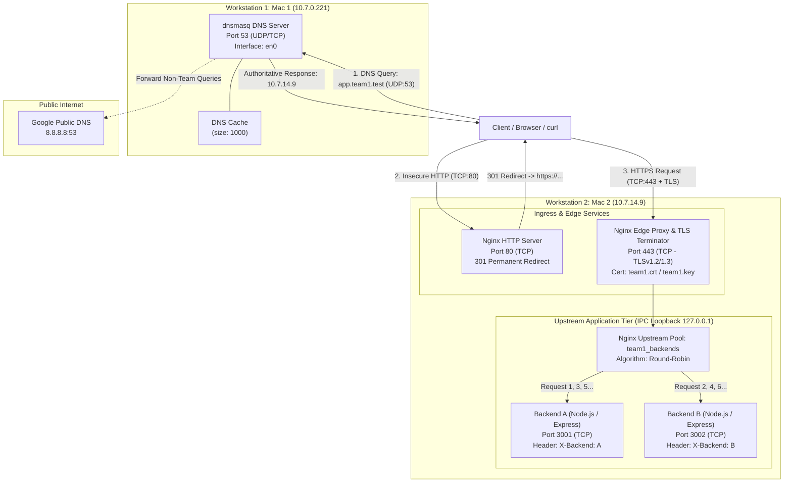

# System Architecture Specification
## Multi-Tier Private Network Service Platform — Team 1

---

### Table of Contents
1. [Executive Summary & Architectural Goals](#1-executive-summary--architectural-goals)
2. [End-to-End System Architecture](#2-end-to-end-system-architecture)
3. [OSI & TCP/IP Layer Mapping](#3-osi--tcpip-layer-mapping)
4. [Component Subsystems Architecture](#4-component-subsystems-architecture)
   - [4.1 Private DNS Subsystem (dnsmasq on Mac 1)](#41-private-dns-subsystem-dnsmasq-on-mac-1)
   - [4.2 Edge Reverse Proxy & Load Balancer (Nginx on Mac 2)](#42-edge-reverse-proxy--load-balancer-nginx-on-mac-2)
   - [4.3 Upstream Application Microservices (Express.js on Mac 2)](#43-upstream-application-microservices-expressjs-on-mac-2)
5. [End-to-End Request & Data Flow Lifecycle](#5-end-to-end-request--data-flow-lifecycle)
6. [Security, Encryption & TLS Termination Architecture](#6-security-encryption--tls-termination-architecture)
7. [Load Balancing & Traffic Distribution Mechanics](#7-load-balancing--traffic-distribution-mechanics)
8. [Caching Subsystem & Performance Optimization](#8-caching-subsystem--performance-optimization)
9. [Empirical Verification & Traceability Matrix](#9-empirical-verification--traceability-matrix)

---

### 1. Executive Summary & Architectural Goals

The **Private Network Service Platform** is a distributed, multi-tier networked service architecture designed to demonstrate foundational and advanced concepts in computer networking, edge reverse proxying, Transport Layer Security (TLS), service discovery, and horizontal load balancing across distinct physical workstations.

```
       +-------------------------------------------------------------+
       |                      PRIVATE LAN / WI-FI                    |
       |                         (10.7.0.0/20)                       |
       +-------------------------------------------------------------+
                     |                                 |
                     v                                 v
       +---------------------------+     +---------------------------+
       |           MAC 1           |     |           MAC 2           |
       |        (10.7.0.221)       |     |        (10.7.14.9)        |
       |  -----------------------  |     |  -----------------------  |
       |    dnsmasq DNS Server     |     |   Nginx Reverse Proxy     |
       |     Port 53 (UDP/TCP)     |     |     Port 80/443 (TCP)     |
       |  -----------------------  |     |             |             |
       |    Resolves .test to      |     |     (Loopback Balancing)  |
       |         Mac 2             |     |       /             \     |
       |                           |     |   Backend A     Backend B |
       |                           |     |  (:3001 TCP)   (:3002 TCP)|
       +---------------------------+     +---------------------------+
```

#### Primary Architectural Objectives:
1. **Decoupled Service Discovery**: Isolate domain resolution from external public authorities using a dedicated, local DNS server (`dnsmasq`) running on a dedicated host (Mac 1).
2. **Unified Edge Gateway**: Expose a single edge reverse proxy and TLS termination point (`nginx`) running on Mac 2 that manages all ingress traffic for custom domains (`app.team1.test` and `api.team1.test`).
3. **Transport Security & Zero Cleartext**: Enforce strict HTTP-to-HTTPS redirection (HTTP 301) and terminate modern TLS (TLSv1.2 and TLSv1.3) at the edge proxy, isolating backend applications from cryptographic handshake overhead.
4. **Stateless Horizontal Load Balancing**: Distribute ingress application traffic across identical backend instances (`Backend A` on port 3001 and `Backend B` on port 3002) using round-robin scheduling.
5. **Caching & Header Enrichment**: Transparently inject HTTP cache control headers (`Cache-Control: public, max-age=60`) and forward client tracking metadata (`X-Real-IP`, `X-Forwarded-For`, `X-Forwarded-Proto`).

---

### 2. End-to-End System Architecture

The system spans two physical workstations (Mac 1 and Mac 2) communicating over an IEEE 802.11 Wi-Fi local area network.



---

### 3. OSI & TCP/IP Layer Mapping

The system utilizes protocols across every layer of the standard network stack:

| OSI Layer | TCP/IP Layer | Protocols / Technologies | Implementation Details & Role |
| :--- | :--- | :--- | :--- |
| **Layer 7: Application** | Application | **HTTP/1.1, DNS, JSON** | • `dnsmasq` serves standard DNS query/responses (RFC 1035).<br>• `nginx` receives HTTP/1.1 requests, proxies them upstream, and returns JSON.<br>• Express.js applications serve endpoints (`/`, `/api/status`). |
| **Layer 6: Presentation** | Application | **TLSv1.2, TLSv1.3, X.509** | • Handled exclusively at Nginx edge on Mac 2.<br>• Decrypts HTTPS payloads using RSA/ECC certificate (`team1.crt`) and private key (`team1.key`).<br>• Unencrypted HTTP forwarded locally to backend services. |
| **Layer 5: Session** | Application | **TLS Session, HTTP Keep-Alive** | • TCP Keep-alive connection persistence (`keepalive_timeout 65`).<br>• Session resumption capabilities within TLS layer. |
| **Layer 4: Transport** | Transport | **TCP & UDP** | • **UDP (Port 53)**: Used for low-latency DNS query resolution.<br>• **TCP (Ports 80, 443)**: Connection-oriented stream transport with 3-way handshake and reliability.<br>• **TCP (Ports 3001, 3002)**: In-host loopback transport between Nginx and Express. |
| **Layer 3: Network** | Internet | **IPv4, ICMP** | • Host routing across LAN subnet `10.7.0.0/20`.<br>• Mac 1: `10.7.0.221`, Mac 2: `10.7.14.9`.<br>• External routing to Google DNS `8.8.8.8`. |
| **Layer 2: Data Link** | Network Access | **Ethernet II, ARP** | • Frame framing, MAC addressing.<br>• Mac 1: `10:9f:41:b6:11:88`<br>• Mac 2: `10:9f:41:b3:be:81`<br>• ARP mapping IP addresses to physical MACs on the local link. |
| **Layer 1: Physical** | Network Access | **IEEE 802.11 Wi-Fi** | • Radio frequency transmission across Wi-Fi interface `en0`. |

---

### 4. Component Subsystems Architecture

#### 4.1 Private DNS Subsystem (dnsmasq on Mac 1)
- **Host**: Mac 1 (`10.7.0.221`)
- **Configuration File**: [`configuration/dnsmasq.conf`](file:///Users/tejastyagi/Desktop/CN_PROJECT/configuration/dnsmasq.conf)
- **Operational Responsibilities**:
  1. **Interface Binding**: Bound strictly to `en0` (`bind-interfaces`, `port=53`), ensuring deterministic listening on the Wi-Fi interface.
  2. **Namespace Isolation**: `no-hosts` and `no-resolv` prevent operating system pollution and unwanted host file overrides.
  3. **Authoritative Local Overrides**:
     ```ini
     address=/app.team1.test/10.7.14.9
     address=/api.team1.test/10.7.14.9
     ```
     Maps all queries for `*.team1.test` to Mac 2.
  4. **Upstream Forwarding**: Non-project queries are forwarded to `server=8.8.8.8` (Google Public DNS) to ensure general internet access is preserved.
  5. **Resolution Caching**: Configured with `cache-size=1000` to minimize upstream recursive query latency.
  6. **Query Auditing**: `log-queries` enables real-time auditing of incoming A/AAAA and PTR lookups.

#### 4.2 Edge Reverse Proxy & Load Balancer (Nginx on Mac 2)
- **Host**: Mac 2 (`10.7.14.9`)
- **Configuration File**: [`configuration/nginx.conf`](file:///Users/tejastyagi/Desktop/CN_PROJECT/configuration/nginx.conf)
- **Core Architecture**:
  1. **Event Model**: Single master process with `worker_processes 1` and `worker_connections 128`, utilizing high-performance non-blocking event loops (`kqueue` on macOS).
  2. **HTTP Redirection Server (Port 80)**:
     - Intercepts unencrypted traffic for `app.team1.test` and `api.team1.test`.
     - Returns HTTP status `301 Moved Permanently` pointing to `https://$host$request_uri`.
  3. **HTTPS Edge Terminator (Port 443)**:
     - Handles TLS handshakes using certificates `/opt/homebrew/etc/nginx/certs/team1.crt` and `/opt/homebrew/etc/nginx/certs/team1.key`.
     - Supports modern cryptographic protocol standards: `TLSv1.2` and `TLSv1.3`.
  4. **Upstream Load Balancing Cluster**:
     ```nginx
     upstream team1_backends {
         server 127.0.0.1:3001;    # Backend A
         server 127.0.0.1:3002;    # Backend B
     }
     ```
     - Uses round-robin scheduling (default algorithm) to distribute requests alternately between `127.0.0.1:3001` and `127.0.0.1:3002`.
  5. **Proxy Header Injection**:
     - Preserves original client context before proxying into the loopback tier:
       - `Host`: Client-requested virtual domain.
       - `X-Real-IP`: Client's physical IP address (`10.7.0.221`).
       - `X-Forwarded-For`: Appended proxy chain client IP.
       - `X-Forwarded-Proto`: Set to `https` to signal downstream services that ingress was secure.
  6. **Cache Policy Injection**:
     - Injects `Cache-Control: public, max-age=60` on proxied responses.

#### 4.3 Upstream Application Microservices (Express.js on Mac 2)
- **Host**: Mac 2 (`10.7.14.9`)
- **Implementations**:
  - Backend A: [`backend-a.js`](file:///Users/tejastyagi/Desktop/CN_PROJECT/backend-a.js) listening on Port 3001.
  - Backend B: [`backend-b.js`](file:///Users/tejastyagi/Desktop/CN_PROJECT/backend-b.js) listening on Port 3002.
- **Architectural Characteristics**:
  - Independent, stateless Node.js / Express microservices.
  - Bound to `0.0.0.0` (accessible locally by Nginx upstream proxy).
  - Diagnostic headers: Each backend injects an identity header `X-Backend: A` or `X-Backend: B` into the HTTP response stream.
  - Endpoints provided:
    - `GET /`: Returns JSON greeting and backend identity.
    - `GET /api/status`: Health check route returning `{ status: "running" }`.

---

### 5. End-to-End Request & Data Flow Lifecycle

When a client initiates a request to `https://app.team1.test/`, the complete step-by-step transaction unfolds across 8 distinct phases:

```
[Client]                [Mac 1: dnsmasq]          [Mac 2: Nginx]         [Mac 2: Backend A/B]
   |                           |                         |                         |
   |--- 1. DNS Query (UDP 53) ->|                         |                         |
   |<-- 2. DNS Reply (10.7.14.9)|                         |                         |
   |                                                     |                         |
   |--- 3. TCP SYN (Port 443) -------------------------->|                         |
   |<-- 4. TCP SYN-ACK ----------------------------------|                         |
   |--- 5. TCP ACK ------------------------------------->|                         |
   |                                                     |                         |
   |<================ 6. TLS Handshake (TLSv1.2/1.3) ===>|                         |
   |                                                     |                         |
   |--- 7. Encrypted HTTPS GET / ----------------------->|                         |
   |                                                     |--- 8. TCP Loopback ---->|
   |                                                     |--- 9. HTTP GET / ------>|
   |                                                     |                         |
   |                                                     |<-- 10. HTTP 200 OK -----|
   |                                                     |    (X-Backend: A/B)     |
   |                                                     |                         |
   |<-- 11. Encrypted HTTPS Response --------------------|                         |
   |    (Headers: Cache-Control, X-Backend)              |                         |
```

1. **DNS Lookup Phase**:
   - Client sends a DNS Query packet over UDP to Mac 1 (`10.7.0.221:53`) querying `app.team1.test`.
   - `dnsmasq` matches local domain rules and returns A record `10.7.14.9`.
2. **TCP Transport Connection Phase**:
   - Client initiates a TCP 3-way handshake with Mac 2 (`10.7.14.9:443`): `SYN` -> `SYN-ACK` -> `ACK`.
3. **TLS Cryptographic Negotiation Phase**:
   - Client sends `ClientHello` advertising cipher suites and TLS extensions.
   - Nginx responds with `ServerHello`, presents its X.509 certificate (`team1.crt`), and negotiates symmetric session keys (ECDHE / AES-GCM).
4. **Encrypted Application Request Phase**:
   - Client sends encrypted HTTP request `GET / HTTP/1.1` with `Host: app.team1.test`.
5. **Edge TLS Decryption & Inspection**:
   - Nginx decrypts the TLS record payload, extracts the HTTP headers, and determines virtual host routing via `server_name`.
6. **Upstream Load Balancing & Reverse Proxying**:
   - Nginx upstream engine evaluates the round-robin pointer in `team1_backends`.
   - Dispatches the request via local TCP loopback (`127.0.0.1`) to either Backend A (`:3001`) or Backend B (`:3002`).
7. **Backend Execution**:
   - Target Express.js application processes the request, appends header `X-Backend: A` (or `B`), serializes JSON response body, and responds to Nginx.
8. **Edge Header Decoration, Encryption & Delivery**:
   - Nginx appends `Cache-Control: public, max-age=60`.
   - Nginx encrypts the HTTP response payload via TLS session cipher and transmits TCP packets across Wi-Fi back to the client.

---

### 6. Security, Encryption & TLS Termination Architecture

#### Cryptographic Boundary Design
The architecture implements **Edge TLS Termination** (also called SSL Offloading):
- **External Network (Untrusted Wi-Fi LAN)**: All client-to-edge traffic is strictly encrypted using TLSv1.2 or TLSv1.3. Eavesdroppers on the wireless channel (capturing via Wireshark) observe only opaque `Application Data` (Content Type 23) records.
- **Internal Loopback (Trusted Host IPC)**: Communication between Nginx and the Node.js instances occurs via `127.0.0.1`. This eliminates cryptographic processing overhead from the application tier while preserving end-to-end security across physical network links.

```
       [ Client ]
           |
     Encrypted TLS (Port 443)
   (Wire Protection across Wi-Fi)
           |
           v
  +------------------------------------------------+
  |  Mac 2 (10.7.14.9)                             |
  |                                                |
  |  [ Nginx Edge Proxy ]                          |
  |    - Terminates TLS                            |
  |    - Authenticates via team1.crt               |
  |           |                                    |
  |     Unencrypted Plain HTTP                     |
  |     (Internal Loopback IPC)                    |
  |      127.0.0.1:3001 / 3002                     |
  |           |                                    |
  |           v                                    |
  |  [ Backend Microservices ]                     |
  +------------------------------------------------+
```

#### Protocol Hardening & Enforced Redirection
- Any plaintext attempt on port 80 triggers an immediate `301 Moved Permanently` response:
  ```nginx
  return 301 https://$host$request_uri;
  ```
- Cleartext HTTP transmission of sensitive application data across the network is strictly prevented.

---

### 7. Load Balancing & Traffic Distribution Mechanics

#### Upstream Scheduling Algorithm
Nginx uses an in-memory **Round-Robin** state machine. Each successive incoming HTTP request to `team1_backends` increments the upstream index:

$$\text{Target Backend} = \text{backends}[\text{request\_counter} \pmod N]$$

Where $N = 2$ (`Backend A: 3001`, `Backend B: 3002`).

#### Request Sequencing Matrix
| Sequence # | Incoming Request Target | Selected Upstream | Response Header `X-Backend` | JSON Payload `backend` |
| :---: | :---: | :---: | :---: | :---: |
| 1 | `https://app.team1.test/` | `127.0.0.1:3001` | `A` | `"A"` |
| 2 | `https://app.team1.test/` | `127.0.0.1:3002` | `B` | `"B"` |
| 3 | `https://app.team1.test/` | `127.0.0.1:3001` | `A` | `"A"` |
| 4 | `https://app.team1.test/` | `127.0.0.1:3002` | `B` | `"B"` |
| 5 | `https://app.team1.test/` | `127.0.0.1:3001` | `A` | `"A"` |
| 6 | `https://app.team1.test/` | `127.0.0.1:3002` | `B` | `"B"` |

This alternating behavior has been empirically proven in terminal loop testing:
```bash
for i in {1..6}; do curl -s -D - https://app.team1.test/ -o /dev/null | grep "X-Backend"; done
```

---

### 8. Caching Subsystem & Performance Optimization

The architecture integrates multi-level caching strategies to minimize latency and redundant computations:

1. **DNS Level Caching (`dnsmasq`)**:
   - `cache-size=1000`: Mac 1 caches recent upstream and internal DNS resolutions in RAM. Repeated requests for external and internal domain names are answered in $< 1\text{ ms}$ without recurring upstream lookups.
2. **HTTP Response Caching (`nginx`)**:
   - Nginx injects:
     ```nginx
     add_header Cache-Control "public, max-age=60";
     ```
   - Informs downstream web browsers and client caches that the response is valid for 60 seconds, reducing load on backend Express processes.
   - Upstream Express services automatically generate standard HTTP `ETag` headers (e.g., `W/"30-qQ14z7qX6cfe53gMvqJ1jmz4/zY"`), enabling conditional HTTP validation (`304 Not Modified`).
3. **Connection Layer Optimization**:
   - `sendfile on;`: Enables kernel-level zero-copy data transfer.
   - `keepalive_timeout 65;`: Sustains open TCP sockets across multiple HTTP requests, avoiding repeated 3-way handshakes and TLS renegotiation cycles.

---

### 9. Empirical Verification & Traceability Matrix

Every architectural tier is verified through captured network traces and terminal logs in the [`evidence/`](file:///Users/tejastyagi/Desktop/CN_PROJECT/evidence) directory:

| Architecture Layer | Verified Capability | Evidence Artifact | Empirical Findings & Proof |
| :--- | :--- | :--- | :--- |
| **DNS Resolution** | Name resolution over UDP port 53 | [`evidence/dns/DNS EVI.png`](file:///Users/tejastyagi/Desktop/CN_PROJECT/evidence/dns/DNS%20EVI.png) | Frame 1431 / 1433: Query for `app.team1.test` from `10.7.14.9` to `10.7.0.221`, resolved with A record `10.7.14.9`. |
| **TCP Transport** | Connection establishment & termination | [`evidence/tcp/TCP.png`](file:///Users/tejastyagi/Desktop/CN_PROJECT/evidence/tcp/TCP.png) | Wireshark filter `tcp.port == 443`: Explicit sequence/ACK tracking, window sizing (`Win=130368`), and `[FIN, ACK]` teardown. |
| **TLS Security** | Encrypted application data | [`evidence/tls/TLS.png`](file:///Users/tejastyagi/Desktop/CN_PROJECT/evidence/tls/TLS.png) | Filter `tls && ip.addr == 10.7.14.9`: TLSv1.2 Record Layer (Content Type 23 - Application Data) verified. |
| **HTTP Layer** | Direct backend communication | [`evidence/http/HTTP EVI.png`](file:///Users/tejastyagi/Desktop/CN_PROJECT/evidence/http/HTTP%20EVI.png) | Frame 4426 / 4430: `GET / HTTP/1.1` on port 3001, returning HTTP 200 OK with `application/json`. |
| **Load Balancing** | Round-robin distribution | [`evidence/load-balancing/Load Balancing.png`](file:///Users/tejastyagi/Desktop/CN_PROJECT/evidence/load-balancing/Load%20Balancing.png) | Terminal verification showing strict alternation: `X-Backend: A`, `B`, `A`, `B`, `A`, `B`. |
| **Caching Layer** | Cache-Control header injection | [`evidence/caching/Caching.png`](file:///Users/tejastyagi/Desktop/CN_PROJECT/evidence/caching/Caching.png) | Response headers confirm `Cache-Control: public, max-age=60` and `ETag`. |
