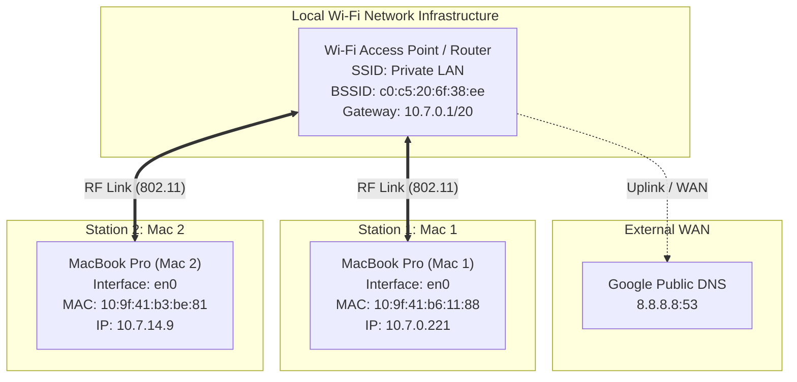
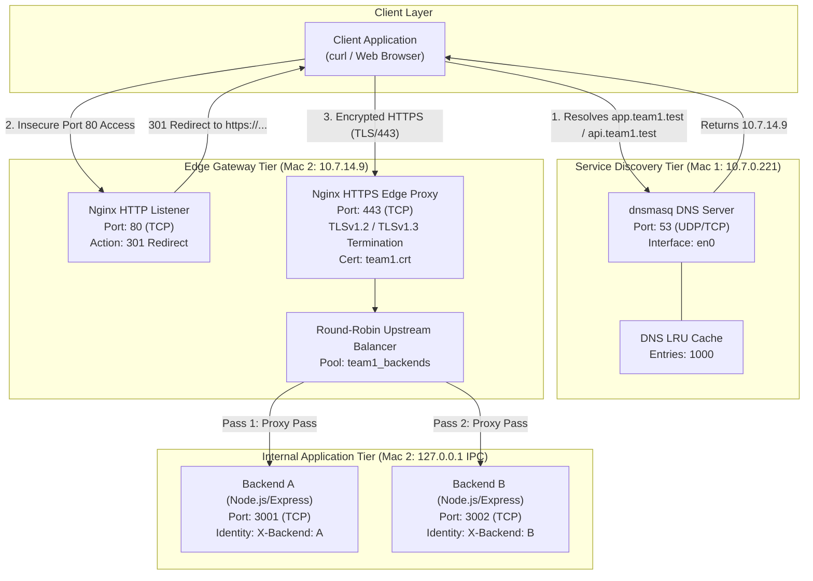

# Network Topology Specification
## Multi-Tier Private Network Service Platform — Team 1

---

### Table of Contents
1. [Network Topology Overview](#1-network-topology-overview)
2. [Physical vs. Logical Topology](#2-physical-vs-logical-topology)
3. [Node & Hardware Interface Inventory](#3-node--hardware-interface-inventory)
4. [Network Topology Diagrams](#4-network-topology-diagrams)
   - [4.1 Physical Infrastructure Diagram](#41-physical-infrastructure-diagram)
   - [4.2 Logical & Protocol Topology Diagram](#42-logical--protocol-topology-diagram)
5. [Layer 4 Socket & Port Allocation Matrix](#5-layer-4-socket--port-allocation-matrix)
6. [DNS Resolution & Routing Topology](#6-dns-resolution--routing-topology)
7. [Packet Flow & Traffic Trajectories](#7-packet-flow--traffic-trajectories)
   - [7.1 DNS Name Resolution Trajectory](#71-dns-name-resolution-trajectory)
   - [7.2 Ingress HTTPS & Loopback Trajectory](#72-ingress-https--loopback-trajectory)
   - [7.3 HTTP Insecure Redirect Trajectory](#73-http-insecure-redirect-trajectory)
8. [Subnetting, Addressing & Network Segmentation](#8-subnetting-addressing--network-segmentation)
9. [Empirical Traceability & Evidence Cross-Reference](#9-empirical-traceability--evidence-cross-reference)

---

### 1. Network Topology Overview

The **Team 1 Private Network Service Platform** is deployed across a distributed local area network (LAN) operating within the `10.7.0.0/20` IPv4 subnet over an IEEE 802.11 wireless medium. 

The topology separates responsibilities between two primary physical computing nodes:
- **Mac 1**: Houses the centralized service discovery and DNS resolution tier.
- **Mac 2**: Houses the public edge ingress gateway (TLS termination & reverse proxying) and the upstream microservice tier (Node.js/Express).

```
                      +-----------------------+
                      |  Upstream Public WAN  |
                      |  Google DNS (8.8.8.8) |
                      +-----------------------+
                                  ^
                                  | (Recursive DNS)
                                  v
                      +-----------------------+
                      |   Wi-Fi Access Point  |
                      |      / L2 Switch      |
                      +-----------------------+
                             /         \
                 (Wi-Fi en0)/           \(Wi-Fi en0)
                           v             v
             +--------------------+   +--------------------+
             |    Node 1: Mac 1   |   |    Node 2: Mac 2   |
             |     10.7.0.221     |   |     10.7.14.9      |
             |   (DNS Discovery)  |   |   (Edge Gateway &  |
             |                    |   |    Microservices)  |
             +--------------------+   +--------------------+
```

---

### 2. Physical vs. Logical Topology

| Characteristic | Physical Topology | Logical Topology |
| :--- | :--- | :--- |
| **Arrangement** | Star topology centered around a shared wireless Access Point (Ruckus Wireless AP). | Multi-tiered hierarchical client-gateway-backend architecture. |
| **Medium** | Over-the-air RF 2.4 GHz / 5 GHz wireless transmission (`en0` interfaces). | Segmented logical communication channels (DNS UDP/53, Edge HTTPS TCP/443, IPC Loopback TCP/3001-3002). |
| **Addressing** | 48-bit Hardware MAC Addresses (`10:9f:41:b6:11:88`, `10:9f:41:b3:be:81`). | 32-bit IPv4 Addressing (`10.7.0.221`, `10.7.14.9`) and Virtual Domains (`*.team1.test`). |
| **Boundaries** | Single physical broadcast domain and RF collision space. | Demarcated network zones: Public Client Zone, Edge DMZ, and Internal Application Zone. |

---

### 3. Node & Hardware Interface Inventory

Detailed hardware, interface, and layer configuration of all participating network entities:

```
+---------------------------------------------------------------------------------------------------------+
|                                    DEVICE HARDWARE & INTERFACE MATRIX                                   |
+-------------------+-------------------+--------------------+-------------------+------------------------+
| Node Identifier   | Machine Name      | IP Address         | MAC Address       | Role & Running Daemons |
+-------------------+-------------------+--------------------+-------------------+------------------------+
| Node 1            | Mac 1             | 10.7.0.221         | 10:9f:41:b6:11:88 | Private DNS Server     |
|                   | (Sankalp's Mac)   | (Subnet: /20)      | (Wi-Fi en0)       | Daemon: dnsmasq (:53)  |
+-------------------+-------------------+--------------------+-------------------+------------------------+
| Node 2            | Mac 2             | 10.7.14.9          | 10:9f:41:b3:be:81 | Edge Gateway & Backends|
|                   | (Tejas's Mac)     | (Subnet: /20)      | (Wi-Fi en0)       | Daemons: nginx (:80/443)|
|                   |                   | 127.0.0.1 (lo0)    | Loopback          | Backend A (:3001)      |
|                   |                   |                    |                   | Backend B (:3002)      |
+-------------------+-------------------+--------------------+-------------------+------------------------+
| Access Point      | Wi-Fi AP / Router | 10.7.0.1 (Gateway) | c0:c5:20:6f:38:ee | 802.11 AP / L2 Switch  |
|                   |                   |                    | (Ruckus Wireless) | Frame Forwarding       |
+-------------------+-------------------+--------------------+-------------------+------------------------+
| External Resolver | Google Public DNS | 8.8.8.8            | WAN Gateway Next  | Recursive DNS Fallback |
|                   |                   |                    | Hop               | Port 53 (UDP)          |
+-------------------+-------------------+--------------------+-------------------+------------------------+
```

---

### 4. Network Topology Diagrams

#### 4.1 Physical Infrastructure Diagram



#### 4.2 Logical & Protocol Topology Diagram



---

### 5. Layer 4 Socket & Port Allocation Matrix

Every active Layer 4 transport socket in the topology is defined below:

| Node | Transport | Bound IP | Port | Process Name | Socket State | Scope / Accessibility | Purpose |
| :--- | :--- | :--- | :--- | :--- | :--- | :--- | :--- |
| **Mac 1** | **UDP** | `10.7.0.221` | `53` | `dnsmasq` | `UNCONNECTED` | LAN Accessible (`en0`) | Inbound DNS queries from LAN clients. |
| **Mac 1** | **TCP** | `10.7.0.221` | `53` | `dnsmasq` | `LISTEN` | LAN Accessible (`en0`) | Large DNS payload / zone queries. |
| **Mac 2** | **TCP** | `0.0.0.0` | `80` | `nginx: master/worker` | `LISTEN` | Public LAN (`en0`) | Insecure HTTP; returns 301 redirect to HTTPS. |
| **Mac 2** | **TCP** | `0.0.0.0` | `443` | `nginx: master/worker` | `LISTEN` | Public LAN (`en0`) | Ingress HTTPS; terminates TLS and load balances. |
| **Mac 2** | **TCP** | `0.0.0.0` | `3001` | `node backend-a.js` | `LISTEN` | Host Local / LAN | Backend instance A microservice. |
| **Mac 2** | **TCP** | `0.0.0.0` | `3002` | `node backend-b.js` | `LISTEN` | Host Local / LAN | Backend instance B microservice. |
| **Client**| **UDP** | Ephemeral | Dynamic | `curl / resolver` | `ACTIVE` | Local Client Stack | Client source port for DNS queries (e.g., port 54514). |
| **Client**| **TCP** | Ephemeral | Dynamic | `curl / browser` | `ESTABLISHED` | Local Client Stack | Client source port for TLS stream (e.g., port 58906). |

---

### 6. DNS Resolution & Routing Topology

The DNS topology decouples the private domain namespace (`*.team1.test`) from public global routing:

```
                            [ Incoming DNS Request ]
                                       |
                                       v
                           [ Mac 1: dnsmasq (:53) ]
                                       |
                     +-----------------+-----------------+
                     |                                   |
             Query in *.team1.test?                      |
                     |                                   |
           +---------+---------+                         |
           |                   |                         |
         YES                   NO                        |
           |                   |                         |
           v                   v                         v
     [ Authoritative ]   [ Recursive Upstream ]     [ Query Logged ]
     app.team1.test ->     Forward to 8.8.8.8        log-queries ->
     10.7.14.9 (Mac 2)   (Google Public DNS)         Audit trail
```

#### Canonical Name Resolution Table
| Domain Record | Record Type | Resolved IP | Canonical Target | Configuration Source |
| :--- | :---: | :--- | :--- | :--- |
| `app.team1.test` | `A` | `10.7.14.9` | Mac 2 (Nginx Edge Proxy) | `dnsmasq.conf: Line 60` |
| `api.team1.test` | `A` | `10.7.14.9` | Mac 2 (Nginx Edge Proxy) | `dnsmasq.conf: Line 61` |
| `*` (Any other domain) | `A/AAAA` | Recursive resolution | Google Public DNS (`8.8.8.8`) | `dnsmasq.conf: Line 75` |

---

### 7. Packet Flow & Traffic Trajectories

#### 7.1 DNS Name Resolution Trajectory
1. **Request Frame**:
   - **L2 Frame**: Source MAC `2e:e6:cb:94:4c:aa`, Destination MAC `9e:fd:fb:74:7f:fc`
   - **L3 Packet**: Source IP `10.7.14.9`, Destination IP `10.7.0.221`
   - **L4 Datagram**: UDP Source Port `54514`, Destination Port `53`
   - **L7 Payload**: DNS Standard Query `0x2ad0` for `A app.team1.test`
2. **Response Frame**:
   - **L2 Frame**: Source MAC `9e:fd:fb:74:7f:fc`, Destination MAC `2e:e6:cb:94:4c:aa`
   - **L3 Packet**: Source IP `10.7.0.221`, Destination IP `10.7.14.9`
   - **L4 Datagram**: UDP Source Port `53`, Destination Port `54514`
   - **L7 Payload**: DNS Response `0x2ad0` A `10.7.14.9`

#### 7.2 Ingress HTTPS & Loopback Trajectory
1. **External Wire Flow (Client -> Mac 2 Edge)**:
   - Client sends TCP `SYN` to `10.7.14.9:443`.
   - Handshake completes: `SYN-ACK` from Mac 2, `ACK` from Client.
   - TLSv1.2/1.3 session negotiated over TCP stream.
   - Encrypted application payload (`TLSv1.2 Application Data`) transmitted across Wi-Fi.
2. **Internal Host Flow (Mac 2 Nginx -> Backend A/B)**:
   - Nginx decrypts TLS record in memory.
   - Checks round-robin state.
   - Forwards unencrypted HTTP request over loopback interface `127.0.0.1` to port 3001 (Backend A) or 3002 (Backend B).
   - Backend replies over loopback with HTTP 200 OK + `X-Backend` header.
3. **Egress Wire Flow (Mac 2 Edge -> Client)**:
   - Nginx injects `Cache-Control: public, max-age=60`.
   - Encrypts HTTP stream with TLS symmetric key.
   - Returns encrypted payload across Wi-Fi to Client.

#### 7.3 HTTP Insecure Redirect Trajectory
1. Client issues `GET / HTTP/1.1` to `10.7.14.9:80`.
2. Nginx port 80 listener immediately constructs HTTP response:
   ```http
   HTTP/1.1 301 Moved Permanently
   Server: nginx/1.31.6
   Location: https://app.team1.test/
   Content-Type: text/html
   Content-Length: 169
   Connection: keep-alive
   ```
3. Client automatically follows redirect and initiates HTTPS connection on port 443.

---

### 8. Subnetting, Addressing & Network Segmentation

#### Subnet Calculations
- **Base Network**: `10.7.0.0`
- **Subnet Mask**: `255.255.240.0` (`/20` CIDR prefix)
- **Usable Host IP Range**: `10.7.0.1` through `10.7.15.254`
- **Total Usable Host Addresses**: 4,094
- **Broadcast Address**: `10.7.15.255`
- **Subnet Verification**:
  - Mac 1 (`10.7.0.221`) and Mac 2 (`10.7.14.9`) reside within the exact same `/20` subnet, enabling direct Layer 2 frame communication without traversal of an inter-VLAN router.

#### Security & Traffic Segmentation Zones
```
+-----------------------------------------------------------------------------+
| ZONE 1: PUBLIC / UNTRUSTED LAN                                              |
| - Medium: Over-the-air Wi-Fi                                                |
| - Traffic: Encrypted HTTPS (Port 443) only; Plain HTTP (Port 80) redirected |
+-----------------------------------------------------------------------------+
                                       |
                     (Edge Demarcation / Nginx Proxy)
                                       |
                                       v
+-----------------------------------------------------------------------------+
| ZONE 2: LOCALHOST IPC TRUSTED ZONE                                          |
| - Medium: Loopback interface (lo0 / 127.0.0.1)                              |
| - Traffic: Plaintext HTTP microservice RPCs (Ports 3001, 3002)              |
| - Protection: Isolated from direct external LAN exposure                     |
+-----------------------------------------------------------------------------+
```

---

### 9. Empirical Traceability & Evidence Cross-Reference

The topology and all claimed network trajectories are empirically validated by the captured Wireshark traces and terminal outputs stored in [`evidence/`](file:///Users/tejastyagi/Desktop/CN_PROJECT/evidence):

```
+---------------------------------------------------------------------------------------------------------+
|                                    EMPIRICAL TOPOLOGY VERIFICATION MATRIX                                |
+-------------------+----------------------------+--------------------------------------------------------+
| Evidence Category | Corresponding Artifact     | Network Parameters Observed & Verified                 |
+-------------------+----------------------------+--------------------------------------------------------+
| **DNS Resolution**| evidence/dns/DNS EVI.png   | • Query/Response matching 10.7.14.9 <-> 10.7.0.221     |
|                   |                            | • Protocol: DNS over UDP Port 53                       |
|                   |                            | • Resolution: app.team1.test -> 10.7.14.9              |
+-------------------+----------------------------+--------------------------------------------------------+
| **TCP Transport** | evidence/tcp/TCP.png       | • Port 443 TCP Stream on 10.7.14.9                     |
|                   |                            | • Sequence & Ack tracking, Win=130368, [FIN, ACK]      |
|                   |                            | • AP BSSID: c0:c5:20:6f:38:ee                          |
+-------------------+----------------------------+--------------------------------------------------------+
| **TLS Security**  | evidence/tls/TLS.png       | • TLSv1.2 Record Layer (Content Type 23 - App Data)    |
|                   |                            | • Frame 1: Encrypted record length 19 bytes            |
|                   |                            | • Ingress endpoint: 10.7.14.9:443                      |
+-------------------+----------------------------+--------------------------------------------------------+
| **HTTP Backend**  | evidence/http/HTTP EVI.png | • Direct HTTP GET / HTTP/1.1                           |
|                   |                            | • Source: 10.7.0.221:63816 -> Dest: 10.7.14.9:3001     |
|                   |                            | • Response: HTTP/1.1 200 OK application/json           |
+-------------------+----------------------------+--------------------------------------------------------+
| **Load Balancing**| evidence/load-balancing/   | • Sequential curl requests to https://app.team1.test/  |
|                   | Load Balancing.png         | • Round-robin alternating response headers:            |
|                   |                            |   X-Backend: A, X-Backend: B, A, B, A, B               |
+-------------------+----------------------------+--------------------------------------------------------+
| **HTTP Caching**  | evidence/caching/          | • Response header: Cache-Control: public, max-age=60   |
|                   | Caching.png                | • ETag header validation present                       |
+-------------------+----------------------------+--------------------------------------------------------+
```
